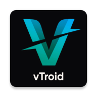

<div align="center">

  

# V-Troid

**Your Ultimate Android Media Hub & Web Stream Interceptor**

  <p>
    <a href="https://github.com/gtxPrime/vtroid/stargazers">
      
    </a>
    <a href="https://github.com/gtxPrime/vtroid/network/members">
      
    </a>
    <a href="https://github.com/gtxPrime/vtroid/issues">
      
    </a>
    <a href="https://github.com/gtxPrime/vtroid/blob/main/LICENSE">
      
    </a>
    <a href="#">
      
    </a>
  </p>

  <h3>
    <a href="#-features">Features</a>
    <span> | </span>
    <a href="#-tech-stack">Tech Stack</a>
    <span> | </span>
    <a href="#-security--safeguards">Security & Safeguards</a>
    <span> | </span>
    <a href="#-installation">Installation</a>
  </h3>

</div>

---

## 📱 About V-Troid

**V-Troid** is a highly optimized, dual-purpose Android application designed to provide a unified media environment. It serves as a high-fidelity local media engine while seamlessly bridging web streams into native, hardware-accelerated playback.

By pairing V-Troid with its companion streaming website, users experience zero UI friction: when a movie or series is selected on the web platform, V-Troid's custom network interceptor hooks the stream URL, filters out web ads and popups, and routes the stream directly into V-Troid's native ExoPlayer wrapper.

> "A seamless bridge between web-based content and native media performance."

---

## 🚀 Features

### 🌐 Companion Web & Interception Engine
V-Troid integrates a custom Chromium-based browser layout configured to dynamically monitor page loads and downloads:
* **Download Redirector**: Intercepts video file links containing `vtroid` or `adminstreamx`, prompting a native sheet that allows you to play the stream instantly or redirect it to a local download agent.
* **Live Streaming Overrides**: Identifies custom `vtroid-live-match` URL protocols to immediately cancel web navigation, extract the raw streaming host, and play it directly on the native player.
* **GDrive Auto-Bypasser**: Automatically injects JavaScript on Google Drive confirmation pages to trigger direct download link clicks.
* **No Pop-ups/No Redirects**: Intercepts and blocks unauthorized browser JavaScript confirmation pop-ups to ensure an ad-free browsing experience.

### 🎬 Powerful Native Video Player
The core playback engine utilizes Google's ExoPlayer, customized with premium options:
* **Tunneled Playback**: Enabling hardware tunneling for superior 4K and HDR playback while reducing battery drain.
* **Auto Frame-Rate Matching**: Automatically switches your device's display refresh rate to match the source video frame rate.
* **Auto Picture-in-Picture (PiP)**: Smooth transition to PiP mode when navigating away from the app.
* **Smart Audio Features**: Toggleable silence-skipping to skip quiet segments in videos automatically.
* **Playback Formats**: Comprehensive support for Progressive streams (MP4, MKV, 3GP, MOV), HLS (`.m3u8`), and DASH formats.

### 🎵 Background Music Player
* **System Service Integration**: Integrates `AudioPlayerService` for continuous, battery-efficient background music playback.
* **Dynamic Audio Control**: Integrates custom equalizers and playlist queue systems.

### 📥 Media & Status Saver
* **WhatsApp Status Saver**: Direct directory access to automatically fetch, preview, and save status images and videos.
* **Instagram Downloader**: In-app private account story and media downloader utilizing persistent cookie jars.

### 🎨 Premium Dynamic UI & Colors
* **Theming Engine**: Dynamic customization of both primary and secondary interface colors at runtime.
* **Custom Components**: Includes custom seeks, rubber loaders, color pickers, and smooth visual animations.

---

## 🛠️ Tech Stack

V-Troid is constructed with a robust and modern stack:
* **Core Language**: Java & Kotlin (Gradle Build System)
* **Media Engine**: [Google ExoPlayer](https://github.com/google/ExoPlayer) (v2.17.1)
* **Network & Parsing**: [Retrofit 3](https://github.com/square/retrofit), [OkHttp 5](https://github.com/square/okhttp), [jsoup 1.22.2](https://github.com/jhy/jsoup), Volley, RxJava 2
* **Database & History**: SQLite for local watch history (`HistorySQLite`, `WListSQLite`)
* **Backend Services**: Firebase BoM (Firestore, Cloud Messaging/FCM, Dynamic Links, Analytics, Crashlytics)
* **Image Caching**: Glide 5, Picasso
* **UI & Animation**: Lottie, Rubber Loader, DoubleTapPlayerView, Pikolo Color Picker, ArcSeekBar

---

## 🔒 Security & Safeguards

To prepare V-Troid for open-source publication and GitHub, all sensitive resources have been completely decoupled from the main repository configuration:

### 1. Keystore Security
No passwords or local keystore credentials are stored in `app/build.gradle`. Instead, the build file searches your local environment:
* Real credentials are loaded locally from `local.properties` (which is excluded from Git).
* If `local.properties` does not contain the key credentials, Gradle automatically falls back to safe dummy parameters so that clean clones compile and run without errors.

To configure your release keys locally, append these to [local.properties](file:///f:/Source%20Codes/V-Troid/local.properties):
```properties
release.storeFile=/absolute/path/to/keystore.jks
release.storePassword=your_keystore_password
release.keyAlias=your_key_alias
release.keyPassword=your_alias_password
```

### 2. Firebase Configurations (`google-services.json`)
The active project `google-services.json` contains Google Cloud and Firebase API keys and is excluded from Git. 
* A template structure is provided in [google-services.json.template](file:///f:/Source%20Codes/V-Troid/app/google-services.json.template).
* To connect V-Troid to your Firebase backend, create a project in the Firebase console, register your package name `com.gtxprime.vtroid`, download your `google-services.json`, and place it in the `/app` folder.

---

## 💻 Installation

1. **Clone the repository**:
   ```bash
   git clone https://github.com/gtxprime/vtroid.git
   cd vtroid
   ```
2. **Setup credentials**:
   * Add your `google-services.json` to the `/app` folder.
   * Provide local SDK path and signing properties in `local.properties` (optional).
3. **Build the project**:
   Use Gradle to build the project directly:
   ```bash
   ./gradlew assembleDebug
   ```

---

## 📸 Screenshots

*Screenshots showcasing the V-Troid application interfaces:*

| Home Dashboard | Custom Video Player | Web Interceptor | Status Saver |
| :---: | :---: | :---: | :---: |
| *[Add Home Screenshot]* | *[Add Player Screenshot]* | *[Add Interception Screenshot]* | *[Add WhatsApp Screenshot]* |

---

## 🤝 Contributing

Contributions are welcome! If you'd like to improve V-Troid, please follow these steps:
1. **Fork** the repository.
2. Create a new feature branch (`git checkout -b feature/your-feature`).
3. Commit your changes (`git commit -m 'Add your feature description'`).
4. Push to the branch (`git push origin feature/your-feature`).
5. Open a **Pull Request**.

Please read [docs/SETUP.md](docs/SETUP.md) for more details on the local development setup.

---

## 📄 License

This project is licensed under the MIT License - see the [LICENSE](LICENSE) file for details.

---

## 📈 Star History

<div align="center">

[](https://star-history.com/#gtxPrime/vtroid&Date)

</div>

