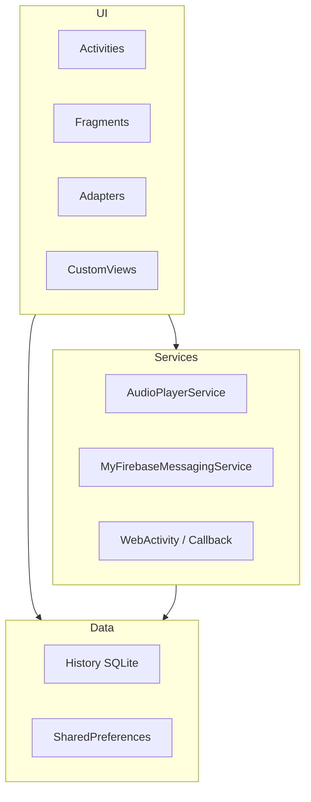

# 🏛️ V-Troid Architecture & Code Structure

Welcome to the architectural overview of **V-Troid**. This document describes the design patterns, layer divisions, directory layout, and data flow of the application.

---

## 🏗️ Architecture Overview

V-Troid is developed following a **Modular & Service-Oriented Android Architecture** design. The application layer focuses on lightweight views and background service delegates to maximize processing performance during heavy video rendering tasks.

---

## 📁 Core Directory Structure

The V-Troid source code is organized under `app/src/main/java/com/gtxprime/vtroid/`:

### 📱 UI & Screen Management (`/Activities`, `/Fragments`, `/Adapters`)
All user interface interactions and screens are driven by native components:
* **`Activities/Home.java`**: The main landing page of the application, managing dynamic drawer options, check updates, premium pass activation checks, and fragment routing.
* **`Activities/FolderActivity.java`**: Scans and groups local device video files into distinct folder categories.
* **`Activities/VideoFiles.java`**: Lists files inside a specific directory using recycler views.
* **`Activities/MusicPlayer.java`**: Complete local audio hub with seek control, background status updates, and custom cues.
* **`Activities/WebActivity.java`**: Embedded browser engine with built-in URL filters to fetch and intercept stream hosts.
* **`VideoPlayer/PlayerActivity.java`**: The core movie/series screen featuring a custom layout wrapper over Google's ExoPlayer.
* **`Adapters/`**: Houses all specialized recycler adapters such as `AdapterRecent`, `AdapterFolderRecent`, and `AdapterVideoFiles` designed for fast scrolling.

### ⚙️ Background Processing (`/Services`)
* **`AudioPlayerService.java`**: Background execution engine managing playlist queues, locks, audio focus loss, and notification player controls.
* **`MyFirebaseMessagingService.java`**: Standard Firebase Cloud Messaging integration for parsing server push notifications.

### 💾 Local Database Cache (`/WatchHistory`, `/Search`)
To ensure features are accessible offline, V-Troid records history locally:
* **`WatchHistory/WListSQLite.java`**: Manages the watch history table.
* **`Search/HistorySQLite.java`**: Saves query strings search history.
* **`Watched.java` & `VisitedPages.java`**: Plain Java Models representing local records.
