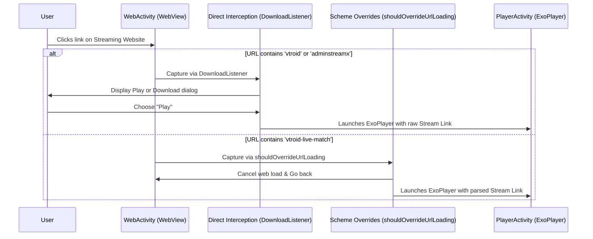

# 🌐 V-Troid Stream Interception & Web Integration

One of the standout features of V-Troid is its ability to serve as a companion client to its streaming websites. It intercepts streaming video resources directly from the web, bypasses intrusive ads/popups, and directs URLs into the native media player.

This document details how the interception mechanism works.

---

## 🔄 Link Capturing Workflow



---

## 🛠️ Interception Techniques

### 1. The Download Listener Hook (`DownloadListener`)
Inside `WebActivity.java`, a download listener is attached to the `WebView` to catch file download requests:
```java
webView.setDownloadListener((url, userAgent, contentDisposition, mimetype, contentLength) -> {
    if (webView.getUrl().contains("vtroid") || webView.getUrl().contains("adminstreamx")) {
        // Triggers dialog_play showing Play / Download buttons
        ...
        play.setOnClickListener(v -> {
            // Extracts filename, adds to Watch History SQLite, starts PlayerActivity
            startActivity(new Intent(WebActivity.this, PlayerActivity.class).putExtra("playLink", url));
        });
    }
});
```

### 2. URL Scheme Override (`shouldOverrideUrlLoading`)
For live matches and dynamic streams, the browser overrides navigation before the page compiles:
```java
@Override
public boolean shouldOverrideUrlLoading(WebView view, WebResourceRequest request) {
    String url = request.getUrl().toString();
    if (url.contains("vtroid-live-match")) {
        webView.stopLoading();
        webView.goBack(); // Backs out of the redirection chain
        String newLink = url.replace("vtroid-live-match", ""); // Clean the protocol
        startActivity(new Intent(WebActivity.this, PlayerActivity.class).putExtra("playLink", newLink));
        return true; // WebView drops navigation
    }
    return false;
}
```

### 3. Google Drive Auto-Bypasser
To avoid forcing users to click through Google Drive warning pages (e.g. "Google Drive can't scan this file for viruses"), `Callback.onPageFinished` injects specialized JavaScript:
```java
if (url != null && url.startsWith("https://drive.google.com")) {
    webView.loadUrl("javascript:(function() { " +
            "    var button = document.getElementById('uc-download-link');" +
            "    if (button) {" +
            "        button.click();" +
            "    }" +
            "})()");
}
```
If the ID `uc-download-link` exists on the finished Google Drive page, V-Troid automatically fires the click, triggering the download listener to capture the video file immediately.

### 4. Popup & Redirect Protection
V-Troid configures custom Chrome clients that drop navigation requests trying to open new windows or spawn alert confirmations:
```java
@Override
public boolean onJsConfirm(WebView view, String url, String message, JsResult result) {
    webView.loadUrl("javascript:window.confirm = function() { return false; };");
    result.cancel();
    return true; // Suppresses alert popup redirection
}
```
This protects users from malicious popups that commonly occur on file hosting websites.
